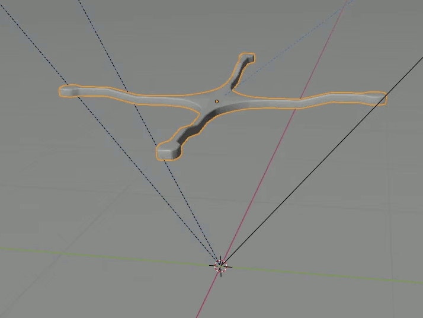

# Quadcopter Simulation in Blender 2.8
## Overview
After a many years break away from Blender, it came as a surprise to me to find that the game engine has been binned in Blender 2.8 - I've always had the desire to try and implement some machine learning and was hoping to utilise the engine's physics and controllers, but alas it is no more. Oh well.

Whilst at university I remember coming across some MATLAB code that was designed to simulate the flight dynamics of a quadcopter - if you're comfortable with 3D dynamics, I would highly recommend taking a look at the [blog](http://andrew.gibiansky.com/blog/physics/quadcopter-dynamics/) and [repo](https://github.com/gibiansky/experiments/tree/master/quadcopter). This project essentially takes the same setup, but implements it in Python and Blender. I would like to implement the simulation timesteps in C++ at some point, but I suspect this is a can of worms that will slow development.

I'm not entirely convinced the rotational transforms for angular velocity have been implemented correctly, but I am hoping my brain will eventually understand what's going wrong; Euler angles still confuse me despite having studied Dynamics throughout university.

## Preview
This is still very much a work in progress: 

## References
Real life implementation:  

